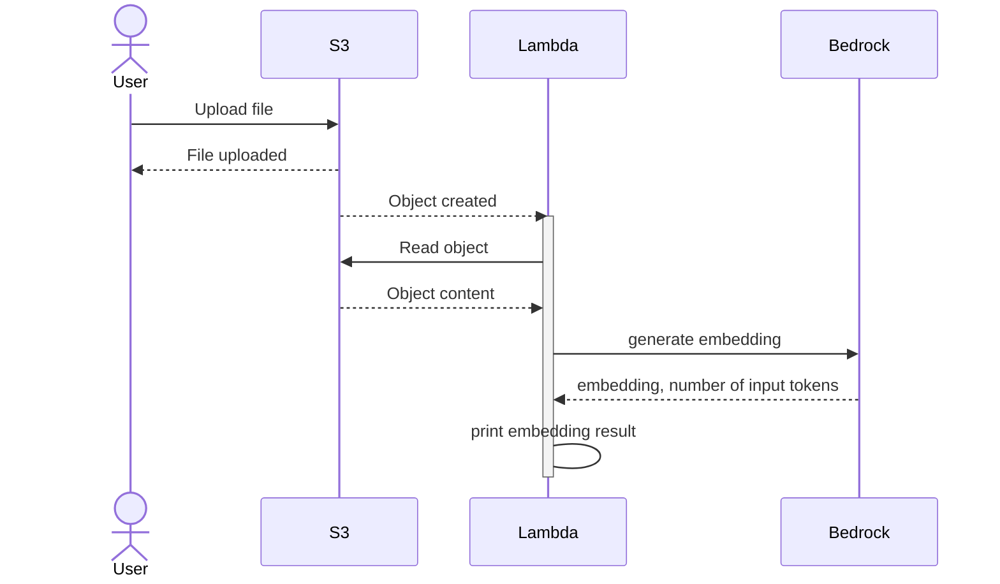

POC to connect AWS lambda, AWS s3 and AWS bedrock

# Prerequisits
Bedrock models should be enabled in desired region. To request access visit this link https://us-west-2.console.aws.amazon.com/bedrock/home?region=us-west-2#/modelaccess

## Deploy
This repo uses cloudformation cdk with nodejs. To deploy use following commands

```bash
$> export AWS_REGION=us-west-2 
$> npm ci
$> npx cdk bootstrap
$> npx cdk deploy
```

To generage CFN template
```bash
$> npx cdk synth 
```

## Structural flow
