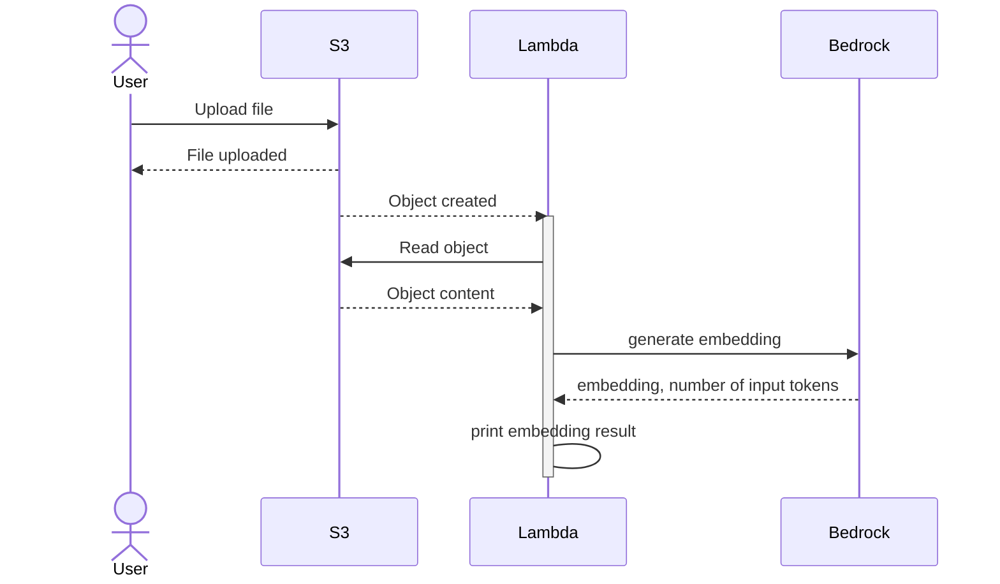

POC to connect AWS lambda, AWS s3 and AWS bedrock

# Prerequisits
Bedrock models should be enabled in desired region. To request access visit this link https://us-west-2.console.aws.amazon.com/bedrock/home?region=us-west-2#/modelaccess

# App structure
This repo uses [AWS CDK](https://docs.aws.amazon.com/cdk/v2/guide/languages.html) as IaC tool

Cloudformation stack is defined in [jscc-poc-cfn-bedrock-stack.ts](./lib/jscc-poc-cfn-bedrock-stack.ts). It creates lambda, s3 bucket and grants peermission to lambda to read/write bucket and invoke bedrock model

Lambda code itself is placed in [lambda/handler.py](lambda/handler.py). It contains function which accept s3 bucket notification event, read object content from s3 and bypass it to bedrock `amazon.titan-embed-text-v2:0` model to generate embedding. Result of embedding might be stored in vector db like (pinecode, fiass, etc.) and for demo purpose is just printed

## Deploy
This repo uses cloudformation cdk with nodejs. To deploy use following commands

```bash
$> export AWS_REGION=us-west-2 
$> npm ci
$> npx cdk bootstrap
$> npx cdk deploy
```

There is command to generage CFN yaml file 
```bash
$> npx cdk synth 
```

## Structural flow
